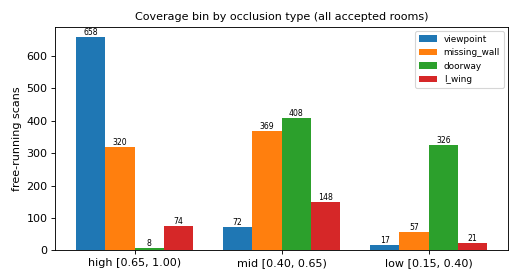

# P4 scan simulator check

Generated by `scripts/simulate_scans.py` at code revision `ae3af48` over 257 accepted D0 rooms; 3 free-running scans per room and occlusion type (seeds 0-2) and one scan aimed at each coverage bin (seed 1000, 15 redraws). Every built sample (3993) passed `contract_v0.validate_sample`.

## Free-running scans: coverage bin by occlusion type

| Type | high | mid | low | other outcomes |
| --- | ---: | ---: | ---: | --- |
| viewpoint | 658 | 72 | 17 | {'clips_canvas': 24} |
| missing_wall | 320 | 369 | 57 | {'not_applicable': 3, 'clips_canvas': 22} |
| doorway | 8 | 408 | 326 | {'bin_not_reached': 29} |
| l_wing | 74 | 148 | 21 | {'not_applicable': 522, 'clips_canvas': 6} |

## Rooms where a scan aimed at each bin succeeded

| Type | high | mid | low |
| --- | ---: | ---: | ---: |
| viewpoint | 247 / 257 | 97 / 257 | 23 / 257 |
| missing_wall | 221 / 257 | 238 / 257 | 76 / 257 |
| doorway | 20 / 257 | 195 / 257 | 196 / 257 |
| l_wing | 75 / 257 | 81 / 257 | 46 / 257 |

- Rooms with at least one usable free-running sample: 249 of 257.
- Non-convex rooms (L-wing applicable in principle): 84.
- Overlays for 20 rooms in `reports/figures/p4/`.

## Method

- Rays (360 per full turn, 5-8 m range) stop at every segment of the 1.1 m slice, furniture included; hits are observed wall cells, swept free space is observed free cells. Missing wall hides one observed wall and 1 m around it; doorway is one scanner 0.5 m inside a wall with a 120 degree view; L-wing hides a concave wing (10-50 % of the area) of a non-convex room.
- Coverage = observed outer-wall length / total outer-wall length; bins high [0.65, 1], mid [0.40, 0.65), low [0.15, 0.40). Thresholds were fixed in code before this run.
- The grid frame comes from the scan only: anchor at the centroid of observed free space, heading from observed surfaces. `clips_canvas` means the room does not fit the 12.8 m canvas around that anchor; such samples are refused, not clipped.
- Versions: python 3.11.9, numpy 2.4.6, scipy 1.17.1, trimesh 4.12.2, shapely 2.1.2, rtree 1.4.1, matplotlib 3.10.9.
- Data: AcousticRooms, CC BY 4.0 (see `DATA_LICENSE.md`). Figures are derived from it.
---

## Notes added by hand (not generated)

Written after reading this run; lost if the script is re-run, so re-add it.

### Gate (plan Stage 1, scan part): PASSED

- 20 overlays checked by eye, one per distinct room across 8 categories
  (no Auditorium or Cafe room fits the canvas). In every panel observed free
  space lies inside the room label, observed walls sit on the outline or on
  furniture, hidden bands and wings stay unobserved, the doorway view is a
  120° wedge, and the grid anchor sits in observed space.
- All 12 type × coverage-bin cells of the histogram are populated (thinnest:
  viewpoint low 17, L-wing low 21 free-running scans).
- All 3 993 built samples pass `contract_v0.validate_sample`; 71 unit tests
  pass on synthetic rooms without the dataset.

### What P6 should know

- **249 of 257 accepted rooms produce samples.** The other 8 never fit the
  12.8 m canvas around an observed anchor and are refused, not clipped:
  Auditorium_idx_0/_1, Cafe_idx_0/_1, Office_idx_6/_7/_14/_15 (the same rooms
  D0 put outside 12.8 m).
- **Fixed test masks:** 196 rooms can reach all three coverage bins with some
  occlusion type, 198 can reach the low bin. Low coverage comes mostly from
  doorway (196 rooms) and missing wall (76); viewpoint reaches it in only
  23 rooms, because 1-3 full turns at 5-8 m see most small rooms whole. Use
  `aimed_bins` in `reports/p4_scans_summary.json` to choose applicable
  (room, type, bin) combinations.
- Doorway never reaches 15 % coverage in 10 large rooms (the 8 above plus
  Office_idx_4/_12): one 120° view at <= 8 m sees too little of their walls.
- L-wing applies to 84 non-convex rooms (footprint < 90 % of hull); one,
  Bathrooms_idx_10, has no wing between 10 and 50 % of its area.
- Missing wall often stays in the high bin in rooms with many short walls:
  hiding one wall (>= 1 m) and 1 m around it removes little. The bin, not the
  type, measures difficulty.
- Furniture stops rays and is recorded as observed wall (decision taken for
  this module): the input can show obstacles the target does not.

### Bugs found by the full run and fixed before this one

1. `328dfda`: with no bin requested, scans below 15 % coverage were returned
   (None == None). Regression test.
2. `88a596f`: P4 required exactly one slice part; D0 accepts the largest part
   at >= 98 %. Apartments_idx_18, _22 and _57 each have a 0.005 m² loop
   0.1 m outside the wall and were wrongly refused. Regression test.
3. `ae3af48`: overlays were spent on rooms with no sample; now 20 distinct
   rooms that yield one.

### Open items for other modules

- **P3:** `_scene_polygon` still requires exactly one slice part, so
  `label_acousticrooms_mesh` refuses Apartments_idx_18, _22 and _57, which D0
  accepted. P4 is unaffected (it calls `rasterize_footprint`).
- **P3:** the boundary definition (interior cells within 0.14 m of the wall,
  vs. the plan's "cells the outline passes through") is still to be settled.
- Coverage bin edges (0.65 / 0.40 / 0.15) and the 0.9 convexity ratio are this
  module's choices, fixed in code before the first full run; the plan gives
  only nominal ~80 / ~50 / ~30 %.
