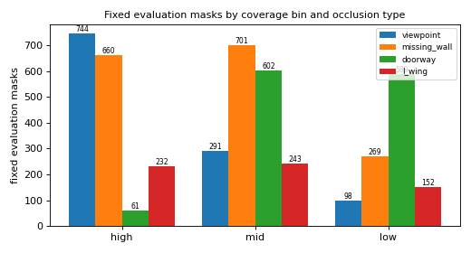

# P6 dataset check

Generated by `scripts/check_dataset.py` at code revision `31ccab3`.

## Fixed evaluation masks

- 4642 samples over 249 of 257 cached rooms; every one re-read, matched its SHA-256 in `data/splits/eval_masks.json` and passed `contract_v0.validate_sample`.
- Each has 8 nested RIRs (K = 1/2/4/8 on the same mask); usable pairs per mask: min 8, median 240, max 5625.
- Scans dropped for having fewer than 8 usable pairs: 129 of 4766.
- (room, type, bin) combinations: {'applicable': 2544, 'no_scan': 937, 'with_masks': 1605, 'not_applicable': 540, 'scans_but_short_of_pairs': 2}.

| Type | high | mid | low |
| --- | ---: | ---: | ---: |
| viewpoint | 744 | 291 | 98 |
| missing_wall | 660 | 701 | 269 |
| doorway | 61 | 602 | 589 |
| l_wing | 232 | 243 | 152 |

## Folds

| Fold | test rooms (groups) | val rooms (groups) | train rooms (groups) | non-convex test rooms | test masks |
| ---: | ---: | ---: | ---: | ---: | ---: |
| 0 | 51 (30) | 27 (18) | 171 (99) | 14 | 898 |
| 1 | 49 (30) | 31 (18) | 169 (99) | 20 | 991 |
| 2 | 48 (29) | 32 (18) | 169 (100) | 16 | 920 |
| 3 | 49 (29) | 31 (18) | 169 (100) | 16 | 886 |
| 4 | 52 (29) | 32 (18) | 165 (100) | 16 | 947 |

- D0 duplicate groups crossing a split, re-checked from `reports/d0_duplicates.json`: **0**.
- Rooms without any evaluation mask, left out of the folds: Auditorium_idx_0, Auditorium_idx_1, Cafe_idx_0, Cafe_idx_1, Office_idx_14, Office_idx_15, Office_idx_6, Office_idx_7.

## Training draws (fold 0)

- 171 training rooms, 2736 items per epoch; probed 200 random items at 0.431 s each (single process).
- K delivered: {1: 28, 2: 25, 3: 23, 4: 21, 5: 28, 6: 25, 7: 27, 8: 23}; draws that got fewer usable pairs than the K requested: 0 of 200.
- Types {'doorway': 57, 'viewpoint': 45, 'missing_wall': 84, 'l_wing': 14}; bins {'mid': 87, 'high': 72, 'low': 41}.
- Overlays of the first 20 probed items: `figures/p6/p6_train_samples_1..5.png`; four fixed test samples: `figures/p6/p6_test_samples.png`.

Versions: python 3.11.9, numpy 2.4.6, scipy 1.17.1, trimesh 4.12.2, shapely 2.1.2, rtree 1.4.1, matplotlib 3.10.9.
---

## Notes added by hand (not generated)

Written after reading this run; lost if the script is re-run, so re-add it.

### Gate (plan Stage 1, dataset part): PASSED

- 20 random training samples of fold 0 and 4 fixed test samples checked by eye
  (`figures/p6/`): in every panel each source and receiver lies in observed
  free space, also after 90/180/270 degree turns and flips; the room label
  covers the whole room; observed walls sit on the outline or on furniture;
  hidden regions stay unobserved; nothing is clipped.
- All unit tests pass (103, synthetic data only, also in CI).
- The fixed-mask histogram covers all three coverage bins and all four
  occlusion types (thinnest cell: doorway high, 61 masks).

### Cross-checks

- **147 independent room groups** take part, the same number D0 reported for
  independent rooms at 12.8 m (signature or identical footprint). The 8 rooms
  without masks are the same 8 that P4 found too large for the 12.8 m canvas.
- 0 D0 duplicate groups cross a split in any fold (re-checked independently
  of `make_folds`).
- Every fold's test part has 14-20 non-convex rooms and 886-991 fixed masks.

### What the numbers mean for training and evaluation

- Fixed masks have a median of 240 usable pairs (minimum 8 by construction);
  only 129 of 4 766 candidate scans were dropped for having fewer than 8.
- None of 200 probed training draws had to settle for fewer pairs than the
  K it asked for; K = 1..8 comes out uniform.
- Training draws pick (type, bin) uniformly among those a room supports, so
  L-wing (non-convex rooms only) is rarer (14 of 200) and missing wall, which
  reaches all three bins in most rooms, is the most common (84 of 200).
- A training item costs ~0.43 s in one process; with fold 0's 2 736 items per
  epoch that is ~20 min per epoch single-threaded, so use several
  `DataLoader` workers (or cache several epochs of masks ahead of training).

### Open items for other modules

- P3: `_scene_polygon` still refuses Apartments_idx_18/_22/_57 (P6 does not
  use it; it calls `rasterize_footprint`), and the boundary definition is
  still to be settled. Changing either changes `target_boundary` and would
  require regenerating the fixed masks with `--replace`.
- The fixed masks bind to P4 code and P5 processor `p5.2`; a change in either
  must regenerate them deliberately.
